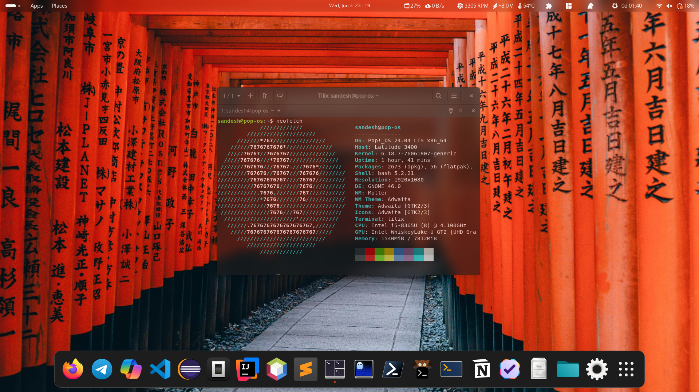
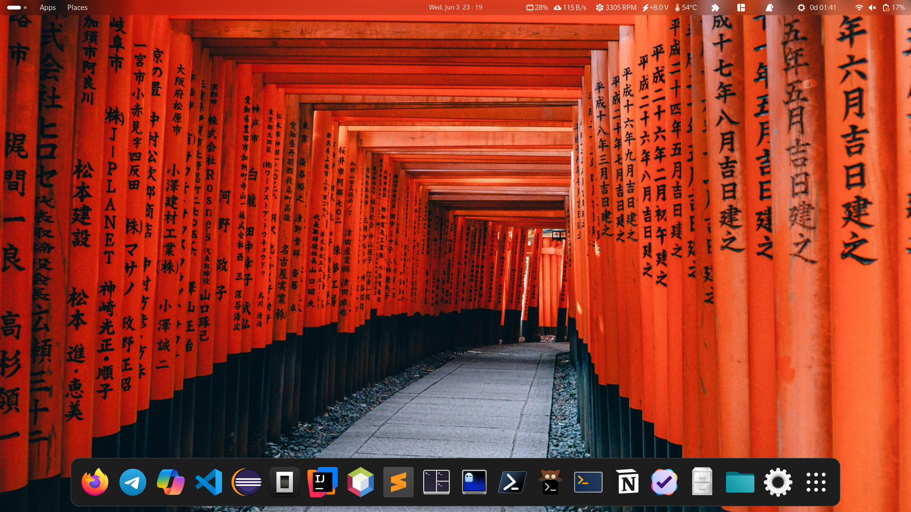
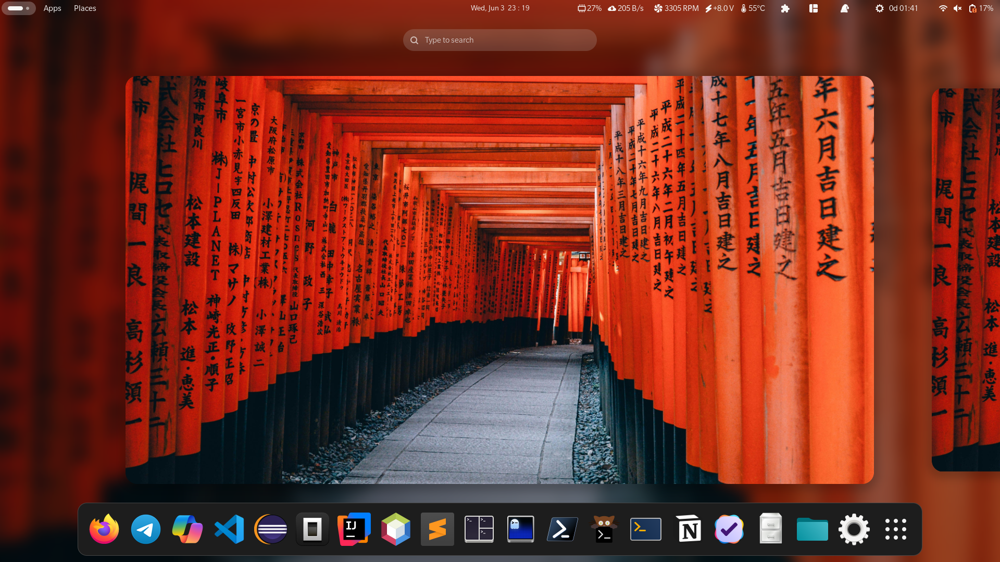

<div align="center">

# 🖥️ popos-setup

**My personal Pop!_OS development environment — dotfiles, configs, and scripts to rebuild from scratch.**


</div>

---

## 📸 Preview

<div align="center">

| Neofetch | Home Screen | Recent Apps |
|:---:|:---:|:---:|
|  |  |  |

</div>

---

## 📁 Structure

```
popos-setup/
├── configs/
│   └── keyd/           # Keyd keyboard remapping config
├── dotfiles/           # Shell dotfiles (.bashrc, aliases, etc.)
├── packages/
│   └── installed-packages.txt   # Full package list snapshot
├── popos/
│   ├── apt/            # APT sources and preferences
│   ├── enabled-services.txt     # Systemd services to enable
│   └── gnome/          # GNOME shell settings & extensions
├── scripts/
│   ├── install.sh      # Package installation script
│   └── setup.sh        # Full environment setup script
├── shell/              # Shell theme / GNOME shell extension
└── sublime/
    └── config/         # Sublime Text preferences & keybindings
```

---

## ✨ What's Included

| Category | Details |
|---|---|
| **Shell** | Bashrc, aliases, prompt config |
| **GNOME** | Extensions, keybindings, settings dump |
| **Keyboard** | Keyd remapping config |
| **Editor** | Sublime Text preferences & keybindings |
| **Packages** | Full APT package list for reproducible installs |
| **Services** | Systemd services snapshot |
| **Scripts** | Automated install + setup scripts |

---

## 🚀 Fresh Install

Clone the repo and run the setup script on a clean Pop!_OS installation:

```bash
git clone https://github.com/sandeshgorde/popos-setup.git
cd popos-setup
bash scripts/install.sh   # Install packages
bash scripts/setup.sh     # Apply configs & dotfiles
```

---

## 🔄 Restore on Existing System

Already running Pop!_OS and just want to sync configs:

```bash
git clone https://github.com/sandeshgorde/popos-setup.git
cd popos-setup
bash scripts/setup.sh
```

---

## ⚠️ Note

> These are **my personal configs** — use them as a reference or starting point. Review the scripts before running them on your machine. Some settings (keyboard layout, GNOME extensions) may need adjustment to suit your hardware.

---

## 📄 License

MIT — see [LICENSE](LICENSE) for details.

---

<div align="center">

Made with ☕ on Pop!_OS &nbsp;·&nbsp; [@sandeshgorde](https://github.com/sandeshgorde)

</div>
